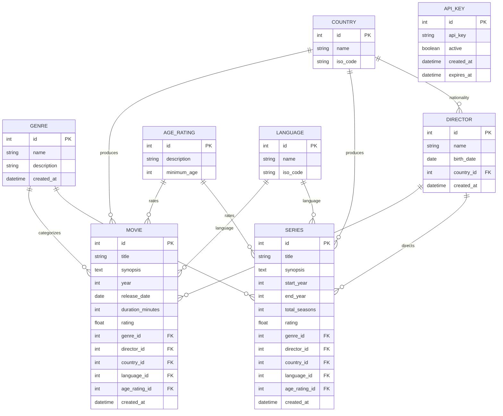

## Database

```mermaid
erDiagram
	direction TB
	COUNTRY {
		int id PK ""  
		string name  ""  
		string iso_code  ""  
	}

	GENRE {
		int id PK ""  
		string name  ""  
		string description  ""  
		datetime created_at  ""  
	}

	DIRECTOR {
		int id PK ""  
		string name  ""  
		date birth_date  ""  
		int country_id FK ""  
		datetime created_at  ""  
	}

	AGE_RATING {
		int id PK ""  
		string description  ""  
		int minimum_age  ""  
	}

	LANGUAGE {
		int id PK ""  
		string name  ""  
		string iso_code  ""  
	}

	API_KEY {
		int id PK ""  
		string api_key  ""  
		boolean active  ""  
		datetime created_at  ""  
		datetime expires_at  ""  
	}

	MOVIE {
		int id PK ""  
		string title  ""  
		text synopsis  ""  
		int year  ""  
		date release_date  ""  
		int duration_minutes  ""  
		float rating  ""  
		int genre_id FK ""  
		int director_id FK ""  
		int country_id FK ""  
        int language_id FK ""  
		int age_rating_id FK ""  
		datetime created_at  ""  
	}

        SERIES {
        int id PK
        string title
        text synopsis
        int start_year
        int end_year
        int total_seasons
        float rating
        int genre_id FK
        int director_id FK
        int country_id FK
        int language_id FK
        int age_rating_id FK
        datetime created_at
    }

GENRE ||--o{ MOVIE : categorizes
    GENRE ||--o{ SERIES : categorizes

    DIRECTOR ||--o{ MOVIE : directs
    DIRECTOR ||--o{ SERIES : directs

    COUNTRY ||--o{ MOVIE : produces
    COUNTRY ||--o{ SERIES : produces
    COUNTRY ||--o{ DIRECTOR : nationality

    LANGUAGE ||--o{ MOVIE : language
    LANGUAGE ||--o{ SERIES : language

    AGE_RATING ||--o{ MOVIE : rates
    AGE_RATING ||--o{ SERIES : rates
```